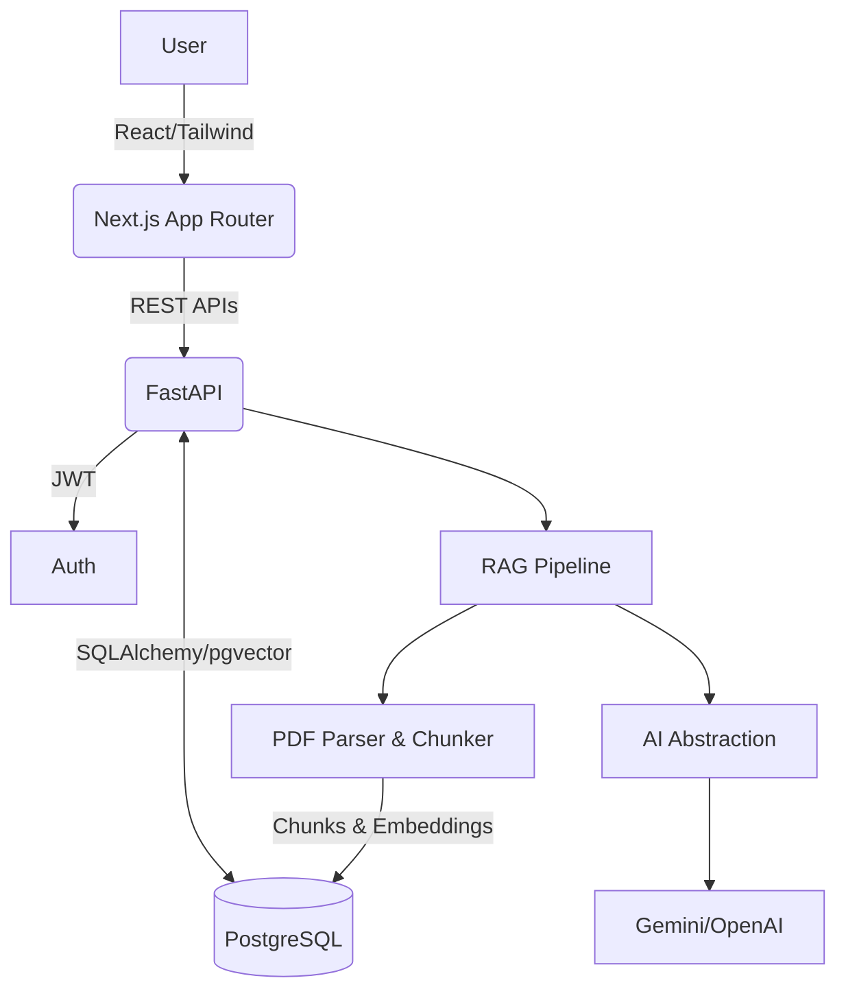

# AI-Powered Study Assistant

A production-quality full-stack web application designed to help students upload study materials, ask questions, generate quizzes, and plan their study schedules using AI and RAG (Retrieval-Augmented Generation).

## 🚀 Features

- **Auth & User Management:** Secure JWT-based authentication.
- **Document Management:** Upload PDFs and text files, organized by Subjects.
- **AI Chat (RAG):** Ask questions about your notes, with citations directly linking to the source material.
- **Auto Quiz Generation:** AI generates MCQs based on your uploaded notes to test your knowledge.
- **Flashcard Generation:** Automatically extract key definitions and concepts into study flashcards (spaced repetition ready).
- **Study Planner:** Generate a personalized daily study schedule based on your available time and confidence levels.
- **Viva/Interview Mode:** A specialized AI examiner that evaluates your answers to conceptual questions.
- **Analytics:** Track study time, quiz scores, and overall progress.

## 🏗️ Architecture



## 🛠️ Technology Stack

- **Frontend:** Next.js (App Router), React, TypeScript, Tailwind CSS, shadcn/ui.
- **Backend:** FastAPI, Python, Pydantic, SQLAlchemy, PyPDF2/pdfplumber.
- **Database:** PostgreSQL with `pgvector` for semantic search/embeddings.
- **AI Integration:** Abstracted AI provider (Defaulting to Gemini, using `google-genai`).
- **Containerization:** Docker & Docker Compose.

## ⚙️ Local Setup

1. **Clone the repository.**
2. **Environment Variables:**
   Copy `.env.example` to `.env` and fill in your `GEMINI_API_KEY` (or `OPENAI_API_KEY`).
3. **Run with Docker:**
   ```bash
   docker-compose up -d --build
   ```
4. **Access the App:**
   - Frontend: `http://localhost:3000`
   - Backend API Docs: `http://localhost:8000/docs`

## 📁 Repository Structure

- `/frontend`: Next.js web application.
- `/backend`: FastAPI server.
  - `/app/api`: REST endpoints.
  - `/app/models`: SQLAlchemy ORM models.
  - `/app/schemas`: Pydantic schemas.
  - `/app/ai`: AI Provider abstraction.
  - `/app/rag`: Semantic search logic.
  - `/app/document_processing`: PDF parsing and text chunking.

## 🚀 Future Improvements

- Add support for DOCX and PPTX files.
- Implement more advanced spaced repetition algorithms.
- Add advanced graph-based RAG.
- Implement collaborative study sessions.
